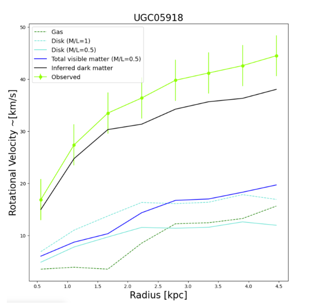
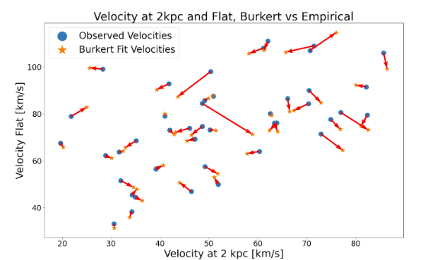
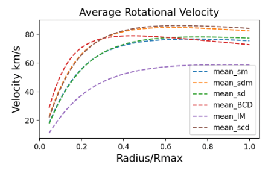
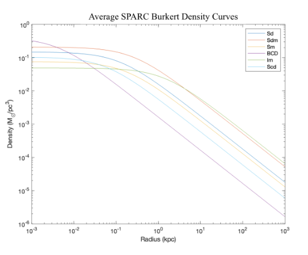
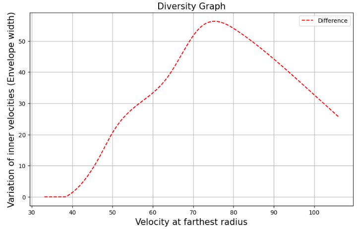
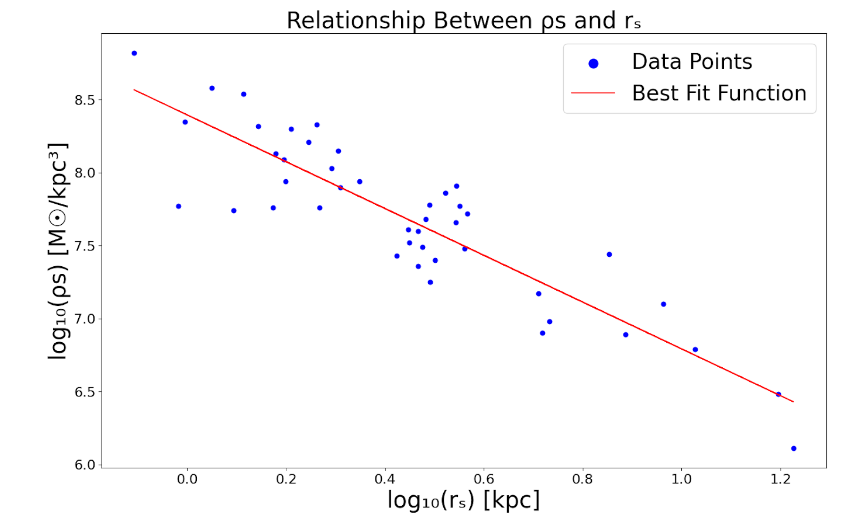

**Abstract**

Our research aims to create an accurate comparison of the dark matter (DM) density and velocity profiles of late-type spiral and dwarf galaxies. This was accomplished using the SPARC3 (Spitzer Photometry & Accurate Rotation Curves) database and the Burkert2 DM density profile. 

We have built upon correlations between Hubble galaxy type and dark matter density distribution by using a broader range of galaxies.

**Introduction - Dark Matter, SPARC, Burkert**

DM is an indetectable form of matter that only interacts with baryonic matter gravitationally. It explains why the rotational velocity of galaxies increases as a function of the distance from the galaxy’s center instead of decreasing. The SPARC database contains rotational velocity data that can be used to model the rotation curves and densities of matter in galaxies. The Burkert model was developed in 1995 to solve the problem of a cusp trending toward infinite DM density in the core of galaxies found in other models. Because Burkert can be used to predict DM density, it can determine corresponding rotational velocities. This model applies best to dwarf, late-type spiral galaxies, and DM dominant galaxies  - Sd, Sm, Sdm, Scd, BCD, and Im - the galaxies mainly used in this study. 

**Methods**

Python and MATLAB6 were used to compare inner and outer velocities in DM-dominated galaxies. To determine which galaxies are DM-dominant, we plotted the observed velocities, velocities contributed by luminous matter assuming an M.L ratio of 0.5, and the inferred velocity contributed by DM. Galaxies where DM contributed more than luminous matter were considered DM-dominant. 

  

**Figure 1:** This figure is a plot of rotational velocity contributions of a DM-dominant galaxy. Inferred dark matter is the primary contributor to rotational velocity in this case. This contribution is even more significant because rotational velocity is calculated by squaring each velocity. 

Once a list of galaxies in the SPARC database that were considered DM-dominant was acquired, we used a variation1 of the Burkert density profile adapted to model rotational velocity to generate rotation curves based on observed velocities. This was achieved using the Curve Fit tool in the Scipy8 module to acquire the best fit with the Burkert function’s fitting parameters. 

These rotation curves were then organized by Hubble type to analyze the differences in the shapes of rotation curves of different galaxy types. We focused on the Hubble types: Sd, Sm, Sdm, Scd, BCD, and Im.

To verify the accuracy of these Burkert rotation curves, we compared the inner and outer rotational velocities to the empirical data fitted with a spline function. 

**Figure 2:** Comparison of empirical data to the Burkert DM matter model. The mean Vflat difference is +0.12, mean V2kpc difference is -2.01. The larger the vector between two points, the less accurate the Burkert model is at modeling rotational velocity for that galaxy. The Burkert model is more accurate for galaxies with rotational Velocities &lt;70 km/s.

To model the DM distribution of a galaxy, we used the Burkert1 DM density profile. This profile takes in the fitting parameters ⍴s and rs which were retrieved from the SPARC database to plot the density profiles of each galaxy. These galaxies were also organized by Hubble type and a fitted average was taken.

**Results & Conclusions**

**Figure 3:** Average rotation curve best fits for DM-dominated galaxies. 

**Figure 4:** Comparing the average DM density functions for DM-dominated galaxies. 

From these averages, we were able to make several conclusions about the mass and size of the DM halos surrounding certain galaxy types. A denser DM halo at extended radii implies a more massive DM halo. Ordered from greatest to least DM density at extended radii by Hubble type: Im, Sdm, Sd, Sm, Scd, BCD.

* Sd, Sm, and Scd: similar DM density distributions.
* BCD: A smaller size results in a high central DM density that decreases rapidly outwards.  
* Sdm: densest spiral DM halos, thus most massive DM halo.
* Im: Contains lowest DM velocities and DM core densities but greatest DM density at extended radii and thus the overall largest DM halo. 

**Figure 5:** This plot describes the variation in inner velocities based on the outer velocity. The diversity curve shows that galaxies with outer velocities ~65-85 km/s have the greatest range of inner velocities with a sharp decline in both directions. The SPARC data confirms a large variation in dwarf galaxy inner rotation curves which currently has no widely accepted reason for happening.

**Figure 6:** The values for ⍴s and rs from the DM density profiles were compared. The relationship between ⍴s and rs is ⍴s∝ rs-1.6 meaning as the scale radius increases, central DM densities decrease. 

**Acknowledgments**

We would like to thank Dr. Manoj Kaplinghat, Mentor Tyler Smith, Ally Hatter, and the UCI COSMOS program for providing us the guidance, opportunity, and environment to complete this project. 

**References**

1Li, P., et al. A Comprehensive Catalog of Dark Matter Halo Models for SPARC Galaxies [Web site]. (2020). Retrieved from https://iopscience.iop.org/article/10.3847/1538-4365/ab700e/pdf

2Burkert, A. The Structure of Dark Matter Halos in Dwarf Galaxies [Web site]. (1995). Retrieved from https://iopscience.iop.org/article/10.1086/309560/pdf

3Lelli, F., et al. Spitzer Photometry & Accurate Rotation Curves [Web site]. (2016). Retrieved from http://astroweb.cwru.edu/SPARC/

4Meurer, G., et al. NGC 2915.II.A Dark Spiral Galaxy With a Blue Compact Dwarf Core [Web site]. (1996). Retrieved from https://ui.adsabs.harvard.edu/abs/1996AJ....111.1551M/abstract

5Gerhardt R. Meurer, Lister Staveley-Smith, N. E. B. Killeen, H I and dark matter in the windy starburst dwarf galaxy NGC 1705, Monthly Notices of the Royal Astronomical Society, Volume 300, Issue 3, November 1998, Pages 705–717, https://doi.org/10.1111/j.1365-8711.1998.t01-1-01905.x

6The MathWorks, I. (2020). Curve Fitting Toolbox. Natick, Massachusetts, United State. Retrieved from https://www.mathworks.com/products/curvefitting.html

7J. D. Hunter, "Matplotlib: A 2D Graphics Environment", Computing in Science & Engineering, vol. 9, no. 3, pp. 90-95, 2007.

8Virtanen P., et al. (2020). SciPy 1.0: Fundamental Algorithms for Scientific Computing in Python. Nature Methods, 17(3), 261-272.
